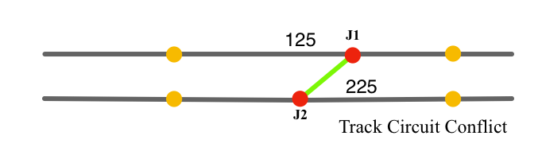

# Track circuit and segment management

Reiterating an NXSYS fundamental, “track *segments*“ are straight lines on the panel, which meet at angles, as is typical of railroad interlocking panels and schematic track diagrams, but have no analogue in real life trackage.   Track segments are to be distinguished from “track *circuits*”, which are extents of track in real life, or the corresponding collection of one or more *track segments* representing them in NXSYS (either of which may have one or more branches at switches) of continuous rail, beginning and ending with an insulated joint (IJ), and containing none internally.  In real life, circuits are the unit of occupation; an entire circuit is either occupied or not. NXSYS segments can meet at insulated joints, or at *kinks*, that is to say, non-insulated joints, which have no analogue in real life: tracks do not have angle bends or meet at angles. Version 2 NXSYS does not use the ambiguous term “track section”, which has utility in real life where circuits and track extents coincide.

You create NXSYS trackage in TLEdit by laying it down between joints. Click the mouse, and you have a joint (if you don't immediately release it)—dragging it creates a track segment ending in another joint. **All joints are uninsulated when created**, and can be insulated (or de-insulated) later, although the new (2.7) restrictions on de-insulating are nontrivial, but fully comply with the expected semantics of track circuits.  These rules also allow the new undo and redo facilities to operate consistently.

Let us call a sets of contiguous track segments delimited from other sets by insulated joints (or end of track) *segment groups*.  In NXSYS 2.7, you can no longer assign track circuits to individual segments.  The Properties Dialog on a segment now brings up the “Track Circuits” Dialog, which allows you to assign a track circuit (by number) ***to an entire segment group***.  The dialog will tell you how many segments are in it before you do.  All segments are created unassigned.  By specifying track circuit 0, or a blank entry field, you can restore a whole segment group to the “unassigned“ state.   Segments with assigned track circuits appear white (as in “routed circuits” in the NXSYS application.

The new rules in 2.7 are designed to prevent you from creating a situation where different track circuits (including “unassigned”) meet at an uninsulated joint.  For instance, if two circuits meet at an insulated joint (the only valid state), *you may not delete (cut) that joint*, because the track circuit of the resulting segment would be ill-defined; the application will prevent such an action.  If you really want to eliminate a track circuit by eliminating a joint, you must decide in advance which circuit will become part of the other, and assign that circuit to the other's segment group, at which point you can delete the joint.  The same applies to deinsulating a joint; the application will disallow this when the insulation separates two differing circuits.

Note that joints between segments of which neither has a track circuit currently assigned may be insulated and deinsulated freely.  To break an established track circuit into two, create a joint where you want it, insulate it, and reassign the segment group you wish to make into a new track circuit.

## Drag-drop merging of insulated joints.

Forbidden, end of discussion. You must remove the insulation from both.

## Creating crossovers

One can and does create crossovers with the greatest of ease by clicking on one track and dragging to another. As in real life, crossovers have to have an insulated joint in their middle to enable trains to pass from the track circuit of the first track to that of the second track.  In TLEdit, of course, you must create the crossover first, and install, then insulate, the joint, subsequently.

It is best if you do this *before* you assign any track circuits.  Then everything will work properly and the crossover halves each belong to the correct track circuit.  But should you fail to create the insulated joint before assigning a track circuit, the following situation would arise:
 

Assume that the upper track, between the two yellow insulated joints, is track circuit 125, and the lower 225.  When you create the crossover, which will be green as is always the case in TLEdit, it connects the two track circuits; the situation is inconsistent. If you attempt to change the single track circuit of the crossover, *it and both circuits at its ends form a single segment group, and* ***all will be changed***.  TLEdit will notice this, and refuse, with the following message:

>The group of segments reachable by non-insulated joints includes more than one assigned track circuit. Create and/or insulate some joints and try again.

