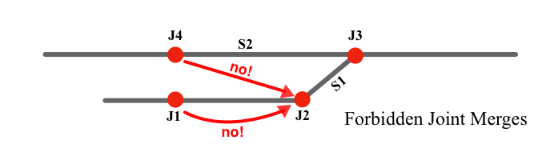

# TLEdit undo

The TLEdit undo system (new with version 2.7) adds the long-needed ability to undo erroneous or unintended keystrokes and other "bad moves", as in other mature interactive applications. It is supposed to work similarly in the expectable way; nevertheless, here is a more detailed discussion. 

Note that unlike some other applications (on the Mac in particular), **TLEdit does not (currently) auto-save**.  **You must/should still save your work** regularly. When you do save, you may no longer undo any changes made previously. This latter behavior, too, may differ from that of some other applications, and may change in the future.

For purposes of this discussion, we will divide all TLEdit user actions into **forward actions** and **presentation actions**.

**Forward actions** are those commands and mouse gestures that affect the content (i.e., the description) of the interlocking, and will be saved when it is written out, and will be visible when it is loaded either in NXSYS or a subsequent invocation of TLEdit. Examples:
* **Creating  and deleting** trackage, joints, and signals
* **Creating and deleting** auxiliary objects (exit lights, traffic levers, auxiliary keys, text strings, etc.)
* **Changing properties** of trackage, joints, or auxiliary objects, including label position, insulation, and nomenclature, whether with the properties dialogs or toolbar commands
* **Assigning** track circuits, including "wildfire" propagation
* **Moving** joints or auxiliary objects, either with the mouse or by editing coordinates.
* **Redefining** the viewport origin, and globally shifting all object positions.

**Presentation actions** are all the rest, i.e., those commands and mouse gestures that affect what you see, but ***do not*** affect the content of the interlocking, and are not reflected in NXSYS. Examples:

* Scrolling, zooming, or reshaping the display window
* Selecting objects
* Setting the geometrical size of the layout at creation time
* Making exit lights visible or invisible
* Showing track circuits

The "undo system" records all forward actions in a *Stack*, that is, a list kept like a stack of papers, such that only the last one placed on it ("pushed onto it") is accessible, i.e., *LIFO*, "last in, first out".  When the last one pushed is removed, the previous one is exposed, and so on.  This stack is called the *Undo Stack*.  When the interlocking is successfully written out to a file, the undo stack is cleared, i.e., all its records discarded.

If the undo stack has records in it, the file needs to be written out.  If it has none, the file which would be written out would be identical to the last file read in, or written out, i.e., the “document” has effectively "not been modified".

The **last forward action** (i.e., the top of the undo stack) can be "undone" by typing **CTRL-Z** (Mac **Cmd-Z**), the **undo keystroke**.  That means that if the last forward action was a "move", the moved object will be returned to its previous position.  If the last forward action was the creation of a signal or auxiliary object such as a text string, the object will be deleted.  If the last forward action was the deletion of a signal or other object, the object will be restored with all its attributes. And so on.  The concept should be familiar.

When a forward action is undone via the **Undo** keystroke, the record of the action is removed from the Undo stack, and pushed onto a second stack, the **Redo stack**, which facilitates the undoing of undoings (as is common). After you've done that, you are in a state (the “**redoable state**”) where three  courses of action are relevant:
* You can type the undo keystroke again, and undo the next older forward action, moving it to the Redo stack.  Doing this repeatedly, you undo entire substantive stretches of modification.
* You can type the **redo keystroke** (**CTRL+SHIFT+Z**, Mac **Cmd-Shift-Z**), which causes the last action undone to be *redone*. It also removes it from the **Redo** stack, but also pushes it back onto the **Undo** stack (so you can undo it again, and perhaps repeat this loop many times). Or you can issue the redo keystroke repeatedly, and so restore entire lengthy stretches of undone actions.
* You can perform some **new forward action**, which will, as all, be pushed on the Undo stack, **but the *Redo stack* will be cleared, i.e., the redoable state will be terminated**. You can still undo that action, and earlier not-undone actions, but you cannot redo undone (but not redone) actions recorded on the Redo stack before the new forward action; they will be gone.  Every forward action (actually issued, not just restored via undo) clears the Redo stack.

Presentation actions do not figure into this, and do not alter the status of the redoable state.

The **Edit** item of the application menu is of extreme interest here.  When either the Undo Stack or Redo Stack has actions in it, the menu items **Undo** and **Redo** will be respectively enabled (and disabled if not).  What is more, the menu items will appear with a brief description of the action at the top of the respective stack, e.g., **Undo create signal**, **Redo move joint**, etc. Thus, selecting the application's **Edit** menu allows you to see if there are undoable and/or redoable actions available, and, if so, what they are.

When the **Undo** and/or **Redo** menu items are enabled on the **Edit** menu, they can, of course, be used instead of the corresponding keystrokes (which will be listed there).

## Joint merging restrictions

In order for Undo to work reliably, some uncommon operations have new restrictions, which are all reasonable. Chief among these is joint merging.  As you know, joints can be dragged with the mouse-right (<b>Ctrl-drag</b> on the Mac) gesture and dropped on empty space or upon extant joints (they cannot be dropped on track not at a joint—you must create a joint at the target point first if that is what you really want to do).

The joint being moved will be called the *movend*, and the joint onto which you are trying to drop it will be called the *receiver*. These are the current restrictions on joint merging. All these “bad moves“ are diagnosed. Please refer to this diagram:

  

-  You may not drop a joint on the other end of either segment emanating from it, i.e., try to reduce a segment to zero length that way. Cut the segment or the joint as appropriate instead, if that is what you are trying to do. That is, in the above, *J1* may not be dragged onto *J2*.

- You may not drop the movend on a joint at the end of a colocated segment, that is, a segment *S1* one of whose ends is the receiver, and whose other end is a third joint, *J*, which latter is connected by another segment, *S2*, to the movend itself.

  That is, if there is a path from the movee to the receiver through exactly two existing segments, the merge is disallowed.  Were it to be permitted, *S1* and *S2* would coincide, connecting *J* to the merged receiver, which is impermissible.  That is, in the above, *J4* may not be dragged onto *J2*, as segments S1 and S2 both “go to” joint *J3*.

- You may not drop a switch on any other joint, nor drop any joint on a switch.

- You may not drop a joint on an insulated joint. If you want to make the receiver be a switch, remove the receiver's insulation first.

- You may not drop an insulated joint on any other joint. If you want to merge them, remove the insulation from the movend first.

- You may not drop a joint not a track-end on any other joint not a track-end; that would cause 4 segments to emanate from the joint (slip switches and grade-crossings are not done that way).

`
 